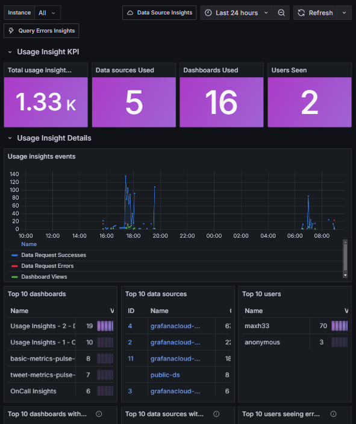
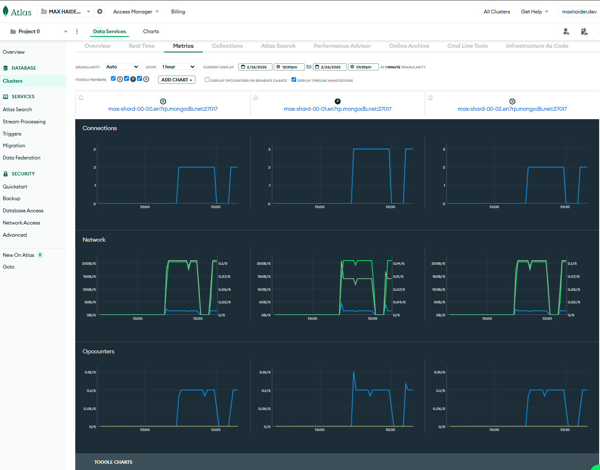
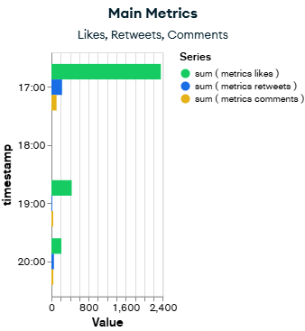
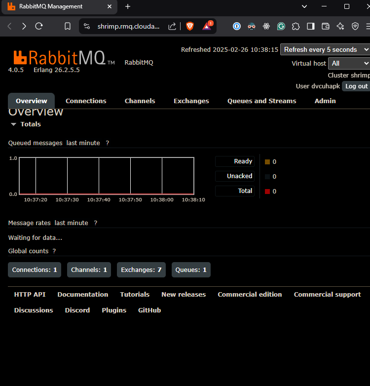

# [Under Development] PulseFlow - Real-Time Social Media Analytics Platform

## Overview

PulseFlow is a backend platform designed for real-time data processing and visualization, leveraging enterprise-grade technologies. This project showcases advanced capabilities in data simulation, monitoring, and analytics, all built on modern DevOps practices

## Features
- Real-time social media data processing
- Sentiment analysis tracking
- Platform usage analytics
- Engagement metrics monitoring
- Performance and health monitoring
- Robust error handling and metrics tracking
- Secure integration with cloud services

## Tech Stack

### Core Technologies
- **Backend**: Node.js + Express with TypeScript
- **Database**: MongoDB with Mongoose ODM
- **Containerization**: Docker & Docker Compose
- **Message Queue**: RabbitMQ with CloudAMQP
- **Testing**: Jest with comprehensive test coverage
- **Code Quality**: ESLint, Prettier, and automated pre-commit hooks

## Architecture Components
- Microservices-based Design: Modular architecture for scalability and maintainability.
- MongoDB Data Storage: Efficient and scalable data management.
- Real-time Metrics Collection: Continuous monitoring of system performance.
- Custom Dashboards: Visual insights through Grafana and MongoDB Charts.

### Message Queue Integration:
- RabbitMQ with CloudAMQP: Utilizes a managed RabbitMQ service for distributed message processing.
- Configuration: Secure, encrypted connections with elastic scaling.
- Key Features: Reliable message queuing, automatic message routing, and error handling with dead-letter queues.
- Message Flow: Synthetic tweet data is generated, published to RabbitMQ, processed asynchronously, and stored in MongoDB.

### CI/CD & DevOps
- **Continuous Integration**: GitHub Actions
- **Container Registry**: GitHub Container Registry
- **Container Orchestration**: Docker Compose
- **Pre-commit Hooks**: Automated code quality and testing checks

## Testing Strategy
The project implements a comprehensive testing approach:
- **Unit Tests**: For individual components and functions
- **Integration Tests**: Validates interactions between components
- **Automated Testing**: Integrated with CI/CD and pre-commit hooks
- **Mocking**: Sophisticated mocking for external dependencies

## Security Improvements
See [SECURITY.md](SECURITY.md) file for details on:
- Recent security updates addressing CVE-2023-45853
- Container security hardening
- Recommended security practices
- Code quality enhancements

## Monitoring Setup
- **Metrics**: Prometheus with custom metrics collection
- **Dashboards**: Grafana with real-time data visualization
- **Health Checks**: Custom endpoints with prometheus-client
- **MongoDB Charts**: For data-specific visualizations

The application exports metrics in Prometheus format and pushes them to Grafana Cloud. A local monitoring stack is also available through Docker Compose.

# Dashboards

## Project Demo Video

**[Watch the Demo Video](https://www.youtube.com/watch?v=O9DCa3mVKJs)**

### Grafana Performance Dashboard

**[>> **SOON** ~~View LIVE Grafana Dashboard HERE~~ <<](https://maxh33.grafana.net/public-dashboards/2f5dd656ee264fd2ac6f13f1aa1b4004)**

### MongoDB Atlas Dashboard

## MongoDB Charts Dashboard

**[>> **SOON** ~~View LIVE MongoDB Charts Dashboard HERE~~ <<](https://charts.mongodb.com/charts-project-0-tmkdyjw/public/dashboards/6798e048-db1e-4c24-85a6-e942bec5d15f)**

### RabbitMQ Cloud Management

## Data Generation Methodology

### Simulated Data Approach
- **Data Source**: Synthetic data generation
- **Randomization Techniques**:
  - Probabilistic content creation
  - Realistic social media interaction patterns
  - Machine learning-based sentiment simulation

### Data Generation Characteristics
- Randomized user profiles
- Contextually relevant tweet content
- Simulated engagement metrics
- Realistic temporal distribution
- Sentiment spectrum simulation

#### Generation Algorithms
- Markov chain text generation
- Weighted sentiment scoring
- Gaussian distribution for interaction rates
- Time-based event probability modeling

### Disclaimer
🚨 **Note**: All data is artificially generated and does not represent real social media interactions.

## Deployment Infrastructure Workflow:

1. **Data Generation:** Synthetic tweets created with Chance.js.
2. **Message Queuing:** Data published to RabbitMQ, ensuring reliable processing.
3. **Data Storage:** Tweets stored in MongoDB for efficient access.
4. **CI/CD:** Automated tests and deployment via GitHub Actions.
5. **Hosting:** Application deployed on Render for scalability.
6. **Monitoring:** Metrics collected and visualized in Grafana.

## Project Status & Quality Checks

### Code Quality Badges

### Code Analysis Details
- **CodeFactor Grade**: A (Excellent)
- **Snyk Security**: No known vulnerabilities
- **Continuous Monitoring**: Automated checks on every commit

### Scan Highlights
- Static code analysis
- Dependency vulnerability scanning
- Best practices enforcement
- Security risk assessment

### Compliance
- OWASP Top 10 considerations
- Secure coding standards
- Regular automated inspections

## Contributing
Contributions are welcome! Please read our contributing guidelines and submit pull requests.